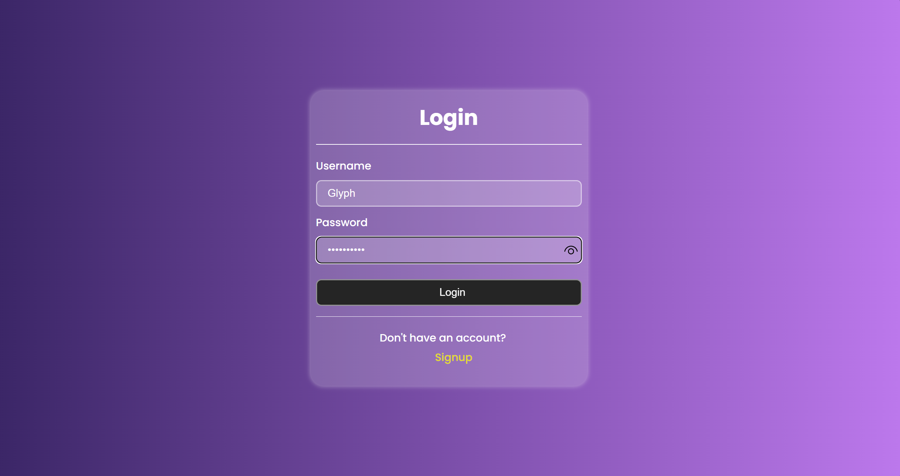
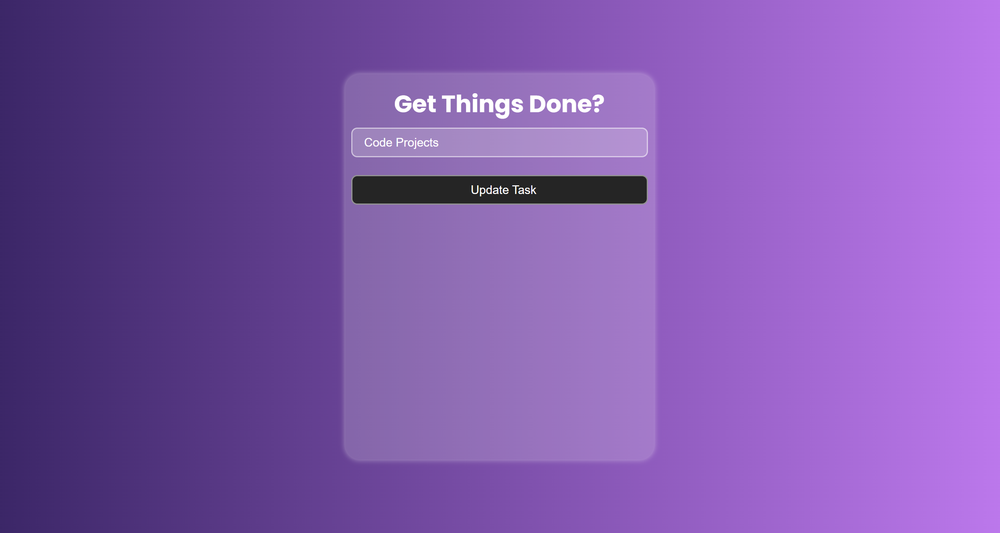

# Django Todo List Application

This is a simple Django web application for managing a personal todo list. It allows users to add, edit, delete, and mark tasks as completed. The project uses Django's built-in SQLite database, which simplifies setup and testing for developers.

## Project Overview

The Django Todo List application provides a minimalistic interface for task management. Key features include:
- Creating new tasks.
- Listing all tasks.
- Updating existing tasks.
- Deleting tasks.
- Marking tasks as completed.

## Prerequisites

Before you begin, ensure you meet the following requirements:
- Python 3.8 or newer
- Django 3.2 or newer
- pip (Python package installer)

## Installation

To set up your local development environment, please follow the steps below:

1. Clone the repository:
   ```bash
   git clone https://github.com/glyphine/ToDoList.git

Change directory to project directory
```bash
cd yourprojectname
```







